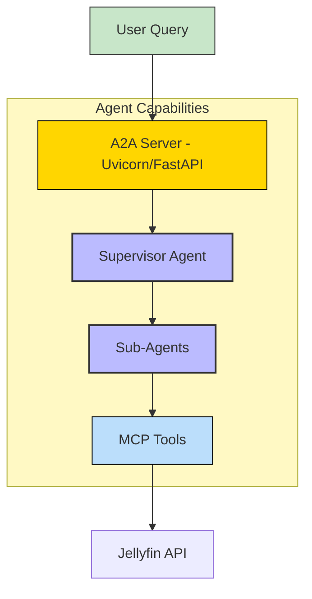
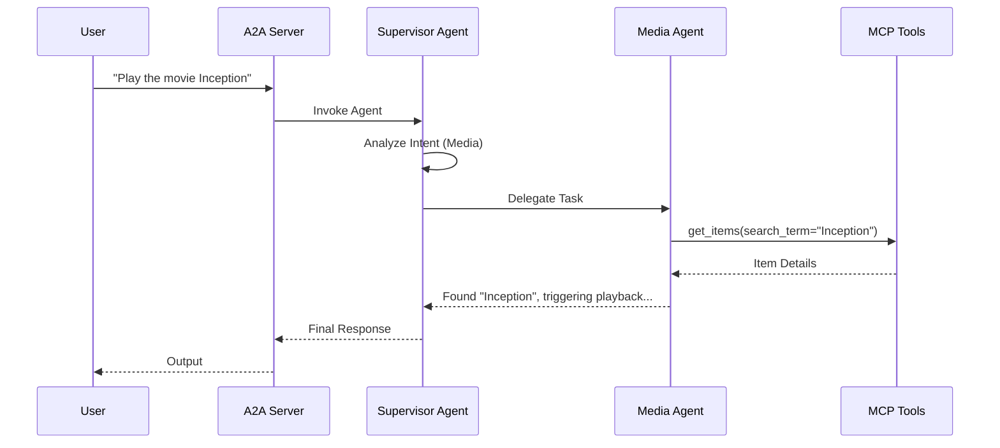

# Jellyfin - A2A | AG-UI | MCP


*Version: 0.1.1*

## Overview

**Jellyfin MCP Server + A2A Agent**

This repository implements a **Model Context Protocol (MCP)** server and an intelligent **Agent-to-Agent (A2A)** system for interacting with a **Jellyfin Media Server**.

It allows AI agents to manage your media library, control playback, query system status, and interact with connected devices using natural language.

This repository is actively maintained - Contributions are welcome!

### Capabilities:
- **Media Management**: Search and retrieve Movies, TV Shows, Music, and more.
- **System Control**: Check server status, configuration, and logs.
- **User & Session Management**: Manage users, view active sessions, and control playback.
- **Live TV**: Access channels, tuners, and guide information.
- **Device Control**: Interact with devices connected to the Jellyfin server.

## MCP

### MCP Tools

The system exposes a comprehensive set of tools, organized by domain. These can be used directly by an MCP client or orchestrated by the A2A Agent.

| Domain | Description | Key Tags |
|:---|:---|:---|
| **Media** | Managing content (Movies, TV, Music), libraries, and metadata. | `Library`, `Items`, `Movies`, `TvShows`, `Music` |
| **System** | Server configuration, logs, plugins, tasks, and system info. | `System`, `Configuration`, `ActivityLog`, `ScheduledTasks` |
| **User** | User supervision, session management, and playstate control. | `User`, `Session`, `Playstate`, `DisplayPreferences` |
| **LiveTV** | Managing Live TV channels, tuners, and recordings. | `LiveTv`, `Channels` |
| **Device** | Managing connected client devices and remote control. | `Devices`, `QuickConnect` |

### Using as an MCP Server

The MCP Server can be run in two modes: `stdio` (for local testing) or `http` (for networked access).

#### Environment Variables
The following environment variables are required to connect to your Jellyfin instance:

*   `JELLYFIN_BASE_URL`: The URL of your Jellyfin server (e.g., `http://192.168.1.10:8096`).
*   `JELLYFIN_TOKEN`: Your Jellyfin API Token.
*   **OR**
*   `JELLYFIN_USERNAME`: Your Jellyfin Username.
*   `JELLYFIN_PASSWORD`: Your Jellyfin Password.

#### Run in stdio mode (default):
```bash
export JELLYFIN_BASE_URL="http://localhost:8096"
export JELLYFIN_TOKEN="your_api_token"
jellyfin-mcp --transport "stdio"
```

#### Run in HTTP mode:
```bash
export JELLYFIN_BASE_URL="http://localhost:8096"
export JELLYFIN_TOKEN="your_api_token"
jellyfin-mcp --transport "http" --host "0.0.0.0" --port "8000"
```

## A2A Agent

This package includes a sophisticated **Supervisor Agent** that delegates tasks to specialized sub-agents based on the user's intent.

### Agent Architecture

*   **Supervisor Agent**: The entry point. Analyzes the request and routes it to the correct specialist.
*   **Media Agent**: Handles content queries ("Play Inception", "Find movies from 1999").
*   **System Agent**: Handles server ops ("Restart the server", "Check logs").
*   **User Agent**: Handles user data ("Create a new user", "What is Bob watching?").
*   **LiveTV Agent**: Handles TV ("What's on channel 5?").
*   **Device Agent**: Handles hardware ("Cast to Living Room TV").



### Component Interaction Diagram



## Usage

### MCP CLI

| Short Flag | Long Flag                          | Description                                                                 |
|------------|------------------------------------|-----------------------------------------------------------------------------|
| -h         | --help                             | Display help information                                                    |
| -t         | --transport                        | Transport method: 'stdio', 'http', or 'sse' [legacy] (default: stdio)       |
| -s         | --host                             | Host address for HTTP transport (default: 0.0.0.0)                          |
| -p         | --port                             | Port number for HTTP transport (default: 8000)                              |
|            | --auth-type                        | Authentication type: 'none', 'static', 'jwt', 'oauth-proxy', 'oidc-proxy', 'remote-oauth' (default: none) |
|            | --token-jwks-uri                   | JWKS URI for JWT verification                                              |
|            | --token-issuer                     | Issuer for JWT verification                                                |
|            | --token-audience                   | Audience for JWT verification                                              |
|            | --oauth-upstream-auth-endpoint     | Upstream authorization endpoint for OAuth Proxy                             |
|            | --oauth-upstream-token-endpoint    | Upstream token endpoint for OAuth Proxy                                    |
|            | --oauth-upstream-client-id         | Upstream client ID for OAuth Proxy                                         |
|            | --oauth-upstream-client-secret     | Upstream client secret for OAuth Proxy                                     |
|            | --oauth-base-url                   | Base URL for OAuth Proxy                                                   |
|            | --oidc-config-url                  | OIDC configuration URL                                                     |
|            | --oidc-client-id                   | OIDC client ID                                                             |
|            | --oidc-client-secret               | OIDC client secret                                                         |
|            | --oidc-base-url                    | Base URL for OIDC Proxy                                                    |
|            | --remote-auth-servers              | Comma-separated list of authorization servers for Remote OAuth             |
|            | --remote-base-url                  | Base URL for Remote OAuth                                                  |
|            | --allowed-client-redirect-uris     | Comma-separated list of allowed client redirect URIs                       |
|            | --eunomia-type                     | Eunomia authorization type: 'none', 'embedded', 'remote' (default: none)   |
|            | --eunomia-policy-file              | Policy file for embedded Eunomia (default: mcp_policies.json)              |
|            | --eunomia-remote-url               | URL for remote Eunomia server                                              |


### A2A CLI
#### Endpoints
- **Web UI**: `http://localhost:8000/` (if enabled)
- **A2A**: `http://localhost:8000/a2a` (Discovery: `/a2a/.well-known/agent.json`)
- **AG-UI**: `http://localhost:8000/ag-ui` (POST)

| Short Flag | Long Flag | Description |
|------------|-----------|-------------|
| -h | --help | Display help information |
| | --host | Host to bind the server to (default: 0.0.0.0) |
| | --port | Port to bind the server to (default: 9001) |
| | --provider | LLM Provider: 'openai', 'anthropic', 'google', 'huggingface' |
| | --model-id | LLM Model ID |
| | --mcp-config | Path to MCP config file |

### Examples

#### Run A2A Server
```bash
export JELLYFIN_BASE_URL="http://localhost:8096"
export JELLYFIN_TOKEN="your_token"
jellyfin-agent --provider openai --model-id gpt-4o --api-key sk-...
```

## Docker

### Build

```bash
docker build -t jellyfin-mcp .
```

### Run MCP Server

```bash
docker run -d \
  --name jellyfin-mcp \
  -p 8000:8000 \
  -e TRANSPORT=http \
  -e JELLYFIN_BASE_URL="http://192.168.1.10:8096" \
  -e JELLYFIN_TOKEN="your_token" \
  knucklessg1/jellyfin-mcp:latest
```

### Deploy with Docker Compose

Create a `docker-compose.yml` file:

```yaml
services:
  jellyfin-mcp:
    image: knucklessg1/jellyfin-mcp:latest
    environment:
      - HOST=0.0.0.0
      - PORT=8000
      - TRANSPORT=http
      - JELLYFIN_BASE_URL=http://your-jellyfin-ip:8096
      - JELLYFIN_TOKEN=your_api_token
    ports:
      - 8000:8000
```

#### Configure `mcp.json` for AI Integration (e.g. Claude Desktop)

```json
{
  "mcpServers": {
    "jellyfin": {
      "command": "uv",
      "args": [
        "run",
        "--with",
        "jellyfin-mcp",
        "jellyfin-mcp"
      ],
      "env": {
        "JELLYFIN_BASE_URL": "http://your-jellyfin-ip:8096",
        "JELLYFIN_TOKEN": "your_api_token"
      }
    }
  }
}
```

## Install Python Package

```bash
python -m pip install jellyfin-mcp
```
```bash
uv pip install jellyfin-mcp
```

## Repository Owners


