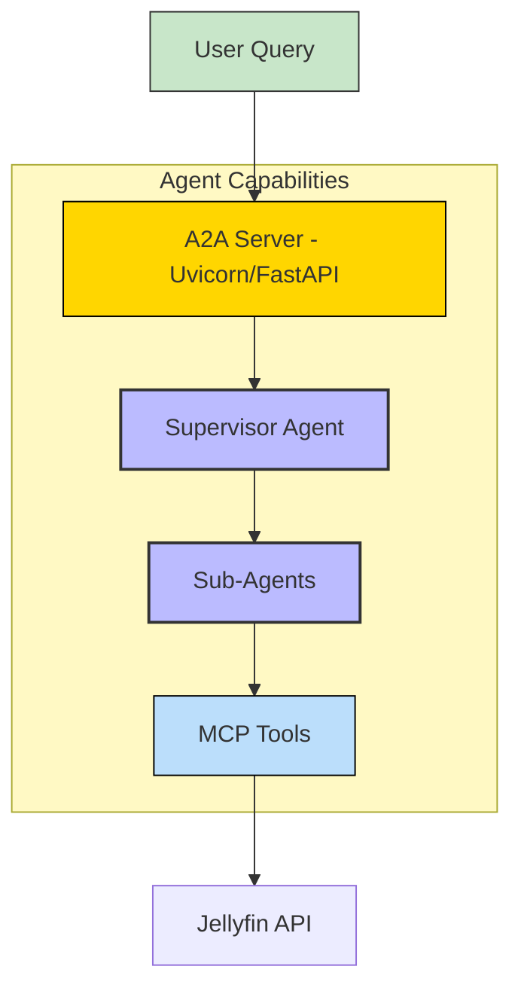
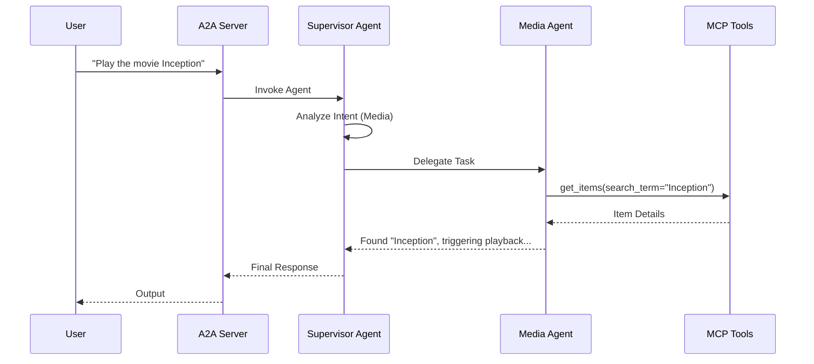
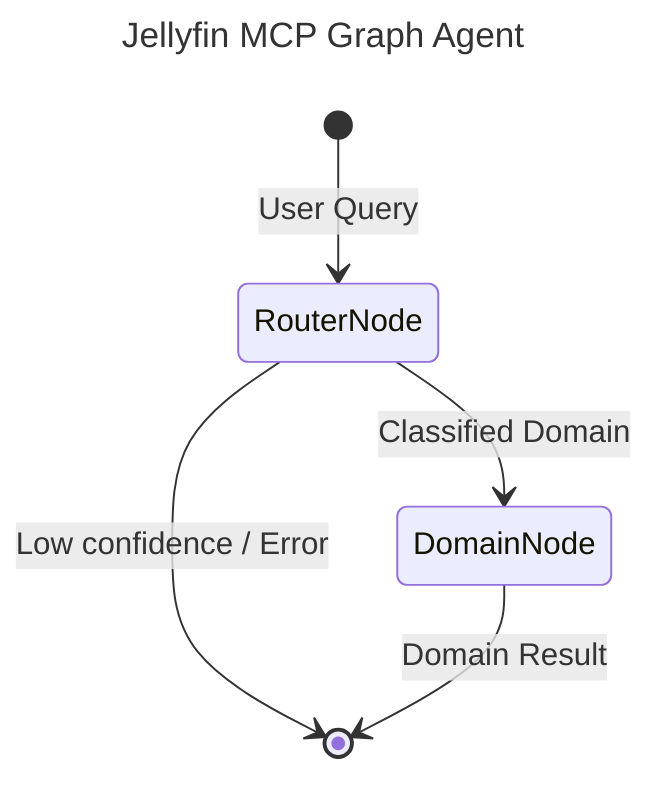

# Jellyfin - A2A | AG-UI | MCP


*Version: 0.12.1*

## Overview

**Jellyfin MCP Server + A2A Agent**

This repository implements a **Model Context Protocol (MCP)** server and an intelligent **Agent-to-Agent (A2A)** system for interacting with a **Jellyfin Media Server**.

It allows AI agents to manage your media library, control playback, query system status, and interact with connected devices using natural language.

This repository is actively maintained - Contributions are welcome!

### Capabilities:
- **Media Management**: Search and retrieve Movies, TV Shows, Music, and more.
- **System Control**: Check server status, configuration, and logs.
- **User & Session Management**: Manage users, view active sessions, and control playback.
- **Live TV**: Access channels, tuners, and guide information.
- **Device Control**: Interact with devices connected to the Jellyfin server.

## MCP

### Available MCP Tools

This server utilizes dynamic Action-Routed tools to optimize token overhead and maximize IDE compatibility.

| Tool Name | Description |
|-----------|-------------|
| `jellyfin_activitylog` | Consolidated Action-Routed tool for ActivityLog. Methods: get_log_entries |
| `jellyfin_apikey` | Consolidated Action-Routed tool for ApiKey. Methods: get_keys, create_key |
| `jellyfin_artists` | Consolidated Action-Routed tool for Artists. Methods: get_artists, get_artist_by_name, get_album_artists |
| `jellyfin_audio` | Consolidated Action-Routed tool for Audio. Methods: get_audio_stream, get_audio_stream_by_container |
| `jellyfin_backup` | Consolidated Action-Routed tool for Backup. Methods: list_backups, create_backup, get_backup, start_restore_backup |
| `jellyfin_branding` | Consolidated Action-Routed tool for Branding. Methods: get_branding_options, get_branding_css, get_branding_css_2 |
| `jellyfin_channels` | Consolidated Action-Routed tool for Channels. Methods: get_channels, get_channel_features, get_channel_items, get_all_channel_features, get_latest_channel_items |
| `jellyfin_clientlog` | Consolidated Action-Routed tool for ClientLog. Methods: log_file |
| `jellyfin_collection` | Consolidated Action-Routed tool for Collection. Methods: create_collection, add_to_collection |
| `jellyfin_configuration` | Consolidated Action-Routed tool for Configuration. Methods: get_configuration, update_configuration, get_named_configuration, update_named_configuration, update_branding_configuration, get_default_metadata_options |
| `jellyfin_dashboard` | Consolidated Action-Routed tool for Dashboard. Methods: get_dashboard_configuration_page, get_configuration_pages |
| `jellyfin_devices` | Consolidated Action-Routed tool for Devices. Methods: get_devices, get_device_info, get_device_options, update_device_options |
| `jellyfin_displaypreferences` | Consolidated Action-Routed tool for DisplayPreferences. Methods: get_display_preferences, update_display_preferences |
| `jellyfin_dynamichls` | Consolidated Action-Routed tool for DynamicHls. Methods: get_hls_audio_segment, get_variant_hls_audio_playlist, get_master_hls_audio_playlist, get_hls_video_segment, get_live_hls_stream, get_variant_hls_video_playlist, get_master_hls_video_playlist |
| `jellyfin_environment` | Consolidated Action-Routed tool for Environment. Methods: get_default_directory_browser, get_directory_contents, get_drives, get_network_shares, get_parent_path, validate_path |
| `jellyfin_filter` | Consolidated Action-Routed tool for Filter. Methods: get_query_filters_legacy, get_query_filters |
| `jellyfin_genres` | Consolidated Action-Routed tool for Genres. Methods: get_genres, get_genre |
| `jellyfin_hlssegment` | Consolidated Action-Routed tool for HlsSegment. Methods: get_hls_audio_segment_legacy_aac, get_hls_audio_segment_legacy_mp3, get_hls_video_segment_legacy, get_hls_playlist_legacy |
| `jellyfin_image` | Consolidated Action-Routed tool for Image. Methods: get_artist_image, get_splashscreen, get_genre_image, get_genre_image_by_index, get_item_image_infos, set_item_image, get_item_image, set_item_image_by_index, get_item_image_by_index, get_item_image2, update_item_image_index, get_music_genre_image, get_music_genre_image_by_index, get_person_image, get_person_image_by_index, get_studio_image, get_studio_image_by_index, post_user_image, get_user_image |
| `jellyfin_instantmix` | Consolidated Action-Routed tool for InstantMix. Methods: get_instant_mix_from_album, get_instant_mix_from_artists, get_instant_mix_from_artists2, get_instant_mix_from_item, get_instant_mix_from_music_genre_by_name, get_instant_mix_from_music_genre_by_id, get_instant_mix_from_playlist, get_instant_mix_from_song |
| `jellyfin_itemlookup` | Consolidated Action-Routed tool for ItemLookup. Methods: get_external_id_infos, apply_search_criteria, get_book_remote_search_results, get_box_set_remote_search_results, get_movie_remote_search_results, get_music_album_remote_search_results, get_music_artist_remote_search_results, get_music_video_remote_search_results, get_person_remote_search_results, get_series_remote_search_results, get_trailer_remote_search_results |
| `jellyfin_itemrefresh` | Consolidated Action-Routed tool for ItemRefresh. Methods: refresh_item |
| `jellyfin_items` | Consolidated Action-Routed tool for Items. Methods: get_item_user_data, update_item_user_data, get_resume_items |
| `jellyfin_itemupdate` | Consolidated Action-Routed tool for ItemUpdate. Methods: update_item, update_item_content_type, get_metadata_editor_info |
| `jellyfin_library` | Consolidated Action-Routed tool for Library. Methods: get_similar_albums, get_similar_artists, get_ancestors, get_critic_reviews, get_file, get_similar_items, get_theme_media, get_theme_songs, get_theme_videos, get_item_counts, get_library_options_info, post_updated_media, get_media_folders, post_added_movies, post_updated_movies, get_physical_paths, refresh_library, post_added_series, post_updated_series, get_similar_movies, get_similar_shows, get_similar_trailers |
| `jellyfin_librarystructure` | Consolidated Action-Routed tool for LibraryStructure. Methods: get_virtual_folders, add_virtual_folder, update_library_options, rename_virtual_folder, add_media_path, update_media_path |
| `jellyfin_livetv` | Consolidated Action-Routed tool for LiveTv. Methods: get_channel_mapping_options, set_channel_mapping, get_live_tv_channels, get_channel, get_guide_info, get_live_tv_info, add_listing_provider, get_default_listing_provider, get_lineups, get_schedules_direct_countries, get_live_recording_file, get_live_stream_file, get_live_tv_programs, get_programs, get_program, get_recommended_programs, get_recordings, get_recording, get_recording_folders, get_recording_groups, get_recording_group, get_recordings_series, get_series_timers, create_series_timer, get_series_timer, update_series_timer, get_timers, create_timer, get_timer, update_timer, get_default_timer, add_tuner_host, get_tuner_host_types, discover_tuners, discvover_tuners |
| `jellyfin_localization` | Consolidated Action-Routed tool for Localization. Methods: get_countries, get_cultures, get_localization_options, get_parental_ratings |
| `jellyfin_lyrics` | Consolidated Action-Routed tool for Lyrics. Methods: get_lyrics, search_remote_lyrics, get_remote_lyrics |
| `jellyfin_mediainfo` | Consolidated Action-Routed tool for MediaInfo. Methods: get_playback_info, get_posted_playback_info, open_live_stream, get_bitrate_test_bytes |
| `jellyfin_mediasegments` | Consolidated Action-Routed tool for MediaSegments. Methods: get_item_segments |
| `jellyfin_movies` | Consolidated Action-Routed tool for Movies. Methods: get_movie_recommendations |
| `jellyfin_musicgenres` | Consolidated Action-Routed tool for MusicGenres. Methods: get_music_genres, get_music_genre |
| `jellyfin_package` | Consolidated Action-Routed tool for Package. Methods: get_packages, get_package_info, install_package, get_repositories, set_repositories |
| `jellyfin_persons` | Consolidated Action-Routed tool for Persons. Methods: get_persons, get_person |
| `jellyfin_playlists` | Consolidated Action-Routed tool for Playlists. Methods: create_playlist, update_playlist, get_playlist, add_item_to_playlist, get_playlist_items, move_item, get_playlist_users, get_playlist_user, update_playlist_user |
| `jellyfin_playstate` | Consolidated Action-Routed tool for Playstate. Methods: on_playback_start, on_playback_progress, report_playback_start, ping_playback_session, report_playback_progress, mark_played_item, mark_unplayed_item |
| `jellyfin_plugins` | Consolidated Action-Routed tool for Plugins. Methods: get_plugins, enable_plugin, get_plugin_image, get_plugin_configuration, update_plugin_configuration, get_plugin_manifest |
| `jellyfin_quickconnect` | Consolidated Action-Routed tool for QuickConnect. Methods: authorize_quick_connect, get_quick_connect_state, get_quick_connect_enabled, initiate_quick_connect |
| `jellyfin_remoteimage` | Consolidated Action-Routed tool for RemoteImage. Methods: get_remote_images, get_remote_image_providers |
| `jellyfin_scheduledtasks` | Consolidated Action-Routed tool for ScheduledTasks. Methods: get_tasks, get_task, update_task, start_task |
| `jellyfin_search` | Consolidated Action-Routed tool for Search. Methods: get_search_hints |
| `jellyfin_session` | Consolidated Action-Routed tool for Session. Methods: get_auth_providers, get_sessions, send_full_general_command, send_general_command, send_message_command, play, send_playstate_command, send_system_command, add_user_to_session, display_content, post_capabilities, post_full_capabilities, report_session_ended, report_viewing |
| `jellyfin_startup` | Consolidated Action-Routed tool for Startup. Methods: complete_wizard, get_startup_configuration, update_initial_configuration, get_first_user_2, set_remote_access, get_first_user, update_startup_user |
| `jellyfin_studios` | Consolidated Action-Routed tool for Studios. Methods: get_studios, get_studio |
| `jellyfin_subtitle` | Consolidated Action-Routed tool for Subtitle. Methods: get_fallback_font_list, get_fallback_font, search_remote_subtitles, get_remote_subtitles, get_subtitle_playlist, get_subtitle_with_ticks, get_subtitle |
| `jellyfin_suggestions` | Consolidated Action-Routed tool for Suggestions. Methods: get_suggestions |
| `jellyfin_system` | Consolidated Action-Routed tool for System. Methods: get_endpoint_info, get_system_info, get_public_system_info, get_system_storage, get_server_logs, get_log_file, get_ping_system, post_ping_system |
| `jellyfin_timesync` | Consolidated Action-Routed tool for TimeSync. Methods: get_utc_time |
| `jellyfin_tmdb` | Consolidated Action-Routed tool for Tmdb. Methods: tmdb_client_configuration |
| `jellyfin_trailers` | Consolidated Action-Routed tool for Trailers. Methods: get_trailers |
| `jellyfin_trickplay` | Consolidated Action-Routed tool for Trickplay. Methods: get_trickplay_tile_image, get_trickplay_hls_playlist |
| `jellyfin_tvshows` | Consolidated Action-Routed tool for TvShows. Methods: get_episodes, get_seasons, get_next_up, get_upcoming_episodes |
| `jellyfin_universalaudio` | Consolidated Action-Routed tool for UniversalAudio. Methods: get_universal_audio_stream |
| `jellyfin_user` | Consolidated Action-Routed tool for User. Methods: get_users, update_user, get_user_by_id, update_user_policy, update_user_configuration, forgot_password, forgot_password_pin, get_current_user, create_user_by_name, update_user_password, get_public_users |
| `jellyfin_userlibrary` | Consolidated Action-Routed tool for UserLibrary. Methods: get_item, get_intros, get_local_trailers, get_special_features, get_latest_media, get_root_folder, mark_favorite_item, unmark_favorite_item, update_user_item_rating |
| `jellyfin_userviews` | Consolidated Action-Routed tool for UserViews. Methods: get_user_views, get_grouping_options |
| `jellyfin_videoattachments` | Consolidated Action-Routed tool for VideoAttachments. Methods: get_attachment |
| `jellyfin_videos` | Consolidated Action-Routed tool for Videos. Methods: get_additional_part, get_video_stream, get_video_stream_by_container, merge_versions |
| `jellyfin_years` | Consolidated Action-Routed tool for Years. Methods: get_years, get_year |

## A2A Agent

This package includes a sophisticated **Supervisor Agent** that delegates tasks to specialized sub-agents based on the user's intent.

### Agent Architecture

*   **Supervisor Agent**: The entry point. Analyzes the request and routes it to the correct specialist.
*   **Media Agent**: Handles content queries ("Play Inception", "Find movies from 1999").
*   **System Agent**: Handles server ops ("Restart the server", "Check logs").
*   **User Agent**: Handles user data ("Create a new user", "What is Bob watching?").
*   **LiveTV Agent**: Handles TV ("What's on channel 5?").
*   **Device Agent**: Handles hardware ("Cast to Living Room TV").


```mermaid
---
config:
  layout: dagre
---
flowchart TB
 subgraph subGraph0["Agent Capabilities"]
        C["Supervisor Agent"]
        B["A2A Server - Uvicorn/FastAPI"]
        D["Sub-Agents"]
        F["MCP Tools"]
  end
    C --> D
    D --> F
    A["User Query"] --> B
    B --> C
    F --> E["Jellyfin API"]

     C:::agent
     D:::agent
     B:::server
     A:::server
     classDef server fill:#f9f,stroke:#333
     classDef agent fill:#bbf,stroke:#333,stroke-width:2px
     style B stroke:#000000,fill:#FFD600
     style F stroke:#000000,fill:#BBDEFB
     style A fill:#C8E6C9
     style subGraph0 fill:#FFF9C4
```

### Component Interaction Diagram


```mermaid
sequenceDiagram
    participant User
    participant Server as A2A Server
    participant Supervisor as Supervisor Agent
    participant MediaAgent as Media Agent
    participant MCP as MCP Tools

    User->>Server: "Play the movie Inception"
    Server->>Supervisor: Invoke Agent
    Supervisor->>Supervisor: Analyze Intent (Media)
    Supervisor->>MediaAgent: Delegate Task
    MediaAgent->>MCP: get_items(search_term="Inception")
    MCP-->>MediaAgent: Item Details
    MediaAgent-->>Supervisor: Found "Inception", triggering playback...
    Supervisor-->>Server: Final Response
    Server-->>User: Output
```


## Graph Architecture

This agent uses `pydantic-graph` orchestration for intelligent routing and optimal context management.


```mermaid
---
title: Jellyfin MCP Graph Agent
---
stateDiagram-v2
  [*] --> RouterNode: User Query
  RouterNode --> DomainNode: Classified Domain
  RouterNode --> [*]: Low confidence / Error
  DomainNode --> [*]: Domain Result
```

- **RouterNode**: A fast, lightweight LLM (e.g., `nvidia/nemotron-3-super`) that classifies the user's query into one of the specialized domains.
- **DomainNode**: The executor node. For the selected domain, it dynamically sets environment variables to temporarily enable ONLY the tools relevant to that domain, creating a highly focused sub-agent (e.g., `gpt-4o`) to complete the request. This preserves LLM context and prevents tool hallucination.

## Usage

### MCP CLI

| Short Flag | Long Flag                          | Description                                                                 |
|------------|------------------------------------|-----------------------------------------------------------------------------|
| -h         | --help                             | Display help information                                                    |
| -t         | --transport                        | Transport method: 'stdio', 'http', or 'sse' [legacy] (default: stdio)       |
| -s         | --host                             | Host address for HTTP transport (default: 0.0.0.0)                          |
| -p         | --port                             | Port number for HTTP transport (default: 8000)                              |
|            | --auth-type                        | Authentication type: 'none', 'static', 'jwt', 'oauth-proxy', 'oidc-proxy', 'remote-oauth' (default: none) |
|            | --token-jwks-uri                   | JWKS URI for JWT verification                                              |
|            | --token-issuer                     | Issuer for JWT verification                                                |
|            | --token-audience                   | Audience for JWT verification                                              |
|            | --oauth-upstream-auth-endpoint     | Upstream authorization endpoint for OAuth Proxy                             |
|            | --oauth-upstream-token-endpoint    | Upstream token endpoint for OAuth Proxy                                    |
|            | --oauth-upstream-client-id         | Upstream client ID for OAuth Proxy                                         |
|            | --oauth-upstream-client-secret     | Upstream client secret for OAuth Proxy                                     |
|            | --oauth-base-url                   | Base URL for OAuth Proxy                                                   |
|            | --oidc-config-url                  | OIDC configuration URL                                                     |
|            | --oidc-client-id                   | OIDC client ID                                                             |
|            | --oidc-client-secret               | OIDC client secret                                                         |
|            | --oidc-base-url                    | Base URL for OIDC Proxy                                                    |
|            | --remote-auth-servers              | Comma-separated list of authorization servers for Remote OAuth             |
|            | --remote-base-url                  | Base URL for Remote OAuth                                                  |
|            | --allowed-client-redirect-uris     | Comma-separated list of allowed client redirect URIs                       |
|            | --eunomia-type                     | Eunomia authorization type: 'none', 'embedded', 'remote' (default: none)   |
|            | --eunomia-policy-file              | Policy file for embedded Eunomia (default: mcp_policies.json)              |
|            | --eunomia-remote-url               | URL for remote Eunomia server                                              |


### A2A CLI
#### Endpoints
- **Web UI**: `http://localhost:8000/` (if enabled)
- **A2A**: `http://localhost:8000/a2a` (Discovery: `/a2a/.well-known/agent.json`)
- **AG-UI**: `http://localhost:8000/ag-ui` (POST)

| Short Flag | Long Flag | Description |
|------------|-----------|-------------|
| -h | --help | Display help information |
| | --host | Host to bind the server to (default: 0.0.0.0) |
| | --port | Port to bind the server to (default: 9001) |
| | --provider | LLM Provider: 'openai', 'anthropic', 'google', 'huggingface' |
| | --model-id | LLM Model ID |
| | --mcp-config | Path to MCP config file |

### Examples

#### Run A2A Server
```bash
export JELLYFIN_BASE_URL="http://localhost:8096"
export JELLYFIN_TOKEN="your_token"
jellyfin-agent --provider openai --model-id gpt-4o --api-key sk-...
```

## Security & Governance

This project is built on [`agent-utilities`](https://github.com/Knuckles-Team/agent-utilities), inheriting enterprise-grade security and governance features.

### Authentication & Authorization
| Feature | Description |
|---------|-------------|
| **OIDC Token Delegation** | RFC 8693 token exchange for user-context propagation from A2A → MCP |
| **Eunomia Policies** | Fine-grained, policy-driven tool authorization (`none`, `embedded`, `remote`) |
| **Scoped Credentials** | Tools execute with the caller's scoped identity where possible |
| **3LO / OAuth / API Token** | Multiple auth strategies with graceful fallback |

### Eunomia Policy Enforcement
Eunomia provides a policy enforcement point for all tool calls:
- **Embedded mode**: Load local `mcp_policies.json` for role-based access, sensitivity gating, and audit logging
- **Remote mode**: Forward authorization decisions to a central Eunomia policy server for multi-agent governance
- Enable via CLI: `--eunomia-type embedded --eunomia-policy-file mcp_policies.json`

### Runtime Protections
| Protection | Description |
|------------|-------------|
| **Tool Guard** | Sensitivity detection with human-in-the-loop approval gating |
| **Prompt Injection Defense** | Input scanning and repetition/loop guards |
| **Content Filtering** | Output schema enforcement and cost budget controls |
| **Stuck Loop Detection** | Automatic detection and recovery from agent loops |
| **Context Limit Warnings** | Proactive alerts before context window exhaustion |

### Graph Agent Architecture
The A2A agent uses `pydantic-graph` orchestration with:
- **RouterNode**: Lightweight classifier that routes queries to specialized domains
- **DomainNode**: Focused executor with only relevant tools loaded, preventing tool hallucination
- **Approval Gates**: Policy-driven approval workflows before sensitive operations
- **Usage Guards**: Budget and rate limiting enforcement

> **Production Recommendation**: Enable `--eunomia-type embedded` (or `remote`) + OIDC delegation + containerized deployment. See [`agent-utilities` documentation](https://github.com/Knuckles-Team/agent-utilities) for full policy configuration.

## Docker

### Build

```bash
docker build -t jellyfin-mcp .
```

### Run MCP Server

```bash
docker run -d \
  --name jellyfin-mcp \
  -p 8000:8000 \
  -e TRANSPORT=http \
  -e JELLYFIN_BASE_URL="http://192.168.1.10:8096" \
  -e JELLYFIN_TOKEN="your_token" \
  knucklessg1/jellyfin-mcp:latest
```

### Deploy with Docker Compose

Create a `docker-compose.yml` file:

```yaml
services:
  jellyfin-mcp:
    image: knucklessg1/jellyfin-mcp:latest
    environment:
      - HOST=0.0.0.0
      - PORT=8000
      - TRANSPORT=http
      - JELLYFIN_BASE_URL=http://your-jellyfin-ip:8096
      - JELLYFIN_TOKEN=your_api_token
    ports:
      - 8000:8000
```

#### Configure `mcp.json` for AI Integration (e.g. Claude Desktop)

```json
{
  "mcpServers": {
    "jellyfin": {
      "command": "uv",
      "args": [
        "run",
        "--with",
        "jellyfin-mcp",
        "jellyfin-mcp"
      ],
      "env": {
        "JELLYFIN_BASE_URL": "http://your-jellyfin-ip:8096",
        "JELLYFIN_TOKEN": "your_api_token"
      }
    }
  }
}
```

## Install Python Package

```bash
python -m pip install jellyfin-mcp
```
```bash
uv pip install jellyfin-mcp
```

## Repository Owners


## MCP Configuration Examples

### stdio (recommended for local development)
```json
{
  "mcpServers": {
    "jellyfin": {
      "command": ".venv/bin/jellyfin-mcp",
      "args": [],
      "env": {
        "JELLYFIN_URL": "",
        "JELLYFIN_API_KEY": ""
}
    }
  }
}
```

### Streamable HTTP (recommended for production)
```json
{
  "mcpServers": {
    "jellyfin": {
      "url": "http://localhost:8080/jellyfin-mcp/mcp"
    }
  }
}
```
